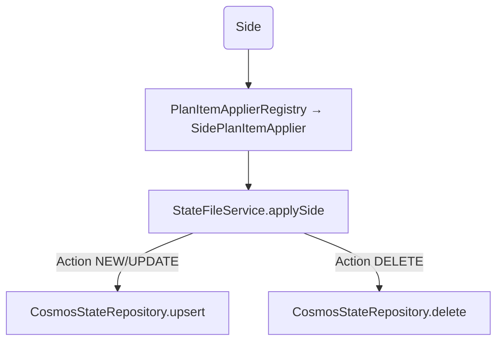

# Sides Plan + Apply

## Architecture Overview

The **Sides** category represents a lightweight but mission-critical state artifact. It communicates the BUY/SELL definitions that downstream categories rely on, so the plan + apply pipeline treats it as a standalone two-phase process before other files are evaluated. This document covers:

1. **Plan** – how changed side JSON files are discovered, keyed, and diffed against persisted Cosmos state.
2. **Apply** – how Side plan items manipulate the Cosmos backing store.

The accompanying Mermaid diagrams (`spec/Sides/sides-plan.mmd` and `spec/Sides/sides-apply.mmd`) render the same sequences so you can reuse them in architecture docs.

## Plan Flow

```mermaid
flowchart TD
    Runner[Plan Runner (CHANGED_FILES)]
    ChangedFile[File under changedfiles/<<scope>>/sides/sideCode-<scope>.json]
    Parser[SideFileParsingStrategy → LoadedFile(SIDE)]
    KeyDerivation[StateFileService.deriveKeyFromFilename ➜ key]
    StateLookup[CosmosStateRepository.find(key, "SIDE")]
    Compare[StateFileService.payloadsEqual]
    EmitNew[PlanItem Action.NEW]
    EmitUpdate[PlanItem Action.UPDATE]
    EmitDelete[PlanItem Action.DELETE]

    Runner --> ChangedFile --> Parser --> KeyDerivation
    KeyDerivation --> StateLookup
    StateLookup --> ExistingPayload
    Parser --> Compare
    ExistingPayload --> Compare
    Compare -->|state empty| EmitNew
    Compare -->|payload differs| EmitUpdate
    Compare -->|file missing| EmitDelete
```

### Details

- Changed files are anchored under `changedfiles/<scope>/sides/`, and `deriveKeyFromFilename` strips the scope suffix (`side1-ATG` → `side1`), so Cosmos document IDs remain consistent.
- `PlanService.processGeneralCategory` caches state payloads per scope and reuses them if multiple files share the same account (not typical for sides but still supported).
- `payloadsEqual` uses Jackson trees, so the comparison is semantic rather than string-based.
- DELETE plan items emit a Cosmos reference such as `cosmos://SIDE/ATG/side1`, which later lets apply know which document to delete.

## Apply Flow



### Details

- `StateFileService.applySide` loads the existing `SideFile` for the scope/key, merges payloads (for deletes it removes the entry), and delegates to `persistListDocument`.
- Upsert uses `stateDocumentId(scope, key)` so documents look like `side1-ATG` (side + scope). The partition key is the category name `SIDE`.
- Delete silently ignores 404s from Cosmos so repeated apply runs do not fail if the document already vanished.
- `SidePlanItemApplier` exists to keep domain-specific apply logic separate; if future integration calls out to LUSID, that API client lives behind the applier while `StateFileService` handles persistence.

## Data Contracts

- **SideFile model** (under `model/SideFile`) holds `scope`, `side`, and optional `SideDefinitionRequest`. The JSON mapping uses `sideDefinitionRequest` to carry the real payload.
- **StateDocument** wraps Cosmos storage fields. For sides, `typeOfItem = SIDE`, the payload is the whole `SideFile`, and `scope` mirrors the parsed scope.
- **PlanItem** capturing `Action`, `FileCategory`, `scope`, `key`, and the payload shape ensures apply has everything it needs.

## Configuration

- `plan.ordering.rules` in `application.properties` ensures Sides are planned before categories that depend on them (e.g., posting rules, GL profiles).
- `CHANGED_FILES` env var is set by scripts (e.g., `integrated-test-plan/run-integration-tests.ps1`), so plan runner only scans provided paths.
- The Cosmos config (endpoint/key/database/container) is injected via `CosmosStateProperties`, and the State repository uses partition key binding for `typeOfItem`.

## Operational Considerations

1. **Idempotency** – upserts replace documents, so reapplying the same Side payload is safe.
2. **Failure recovery** – the PlanRunner logs any JSON parsing issues; apply failures propagate as `PlanApplyException`, leaving the master plan for retry.
3. **Testing** – `StateFileServiceTest` covers side CRUD, and spec scripts (`sides-plan.mmd`/`sides-apply.mmd`) double-check manual flows.

## Example Execution

1. Add `changedfiles/ATG/sides/side1-ATG.json` with a new `SideDefinitionRequest`.
2. Run `CHANGED_FILES=<path> java -jar target/cac-ex.jar --plan` to generate `plan/masterplan.json`.
3. Run the same command with `--apply` to persist the side into Cosmos emulator.
4. The `StateDocument` stored should have `id="side1-ATG"`, `typeOfItem="SIDE"`, and the JSON payload from the file.

This level of documentation ensures team members can update the Sides plan/apply flow without guessing how keys, partitioning, or persistence interact. Keep the Mermaid diagrams in sync whenever new steps get introduced.
