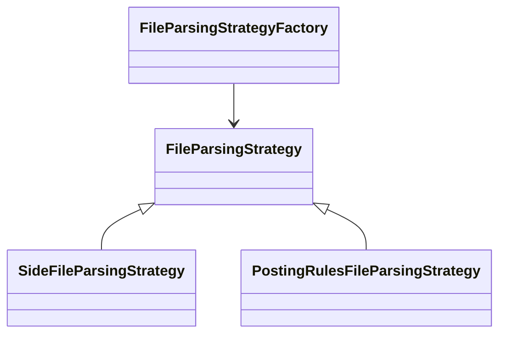
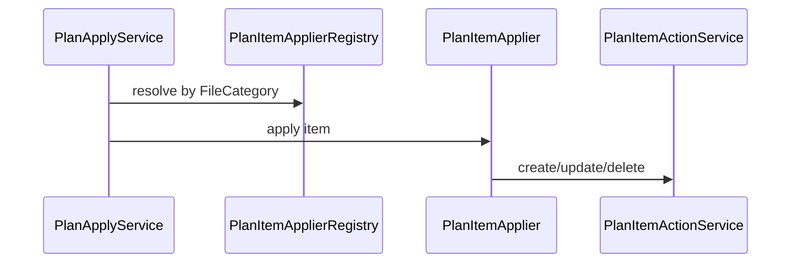
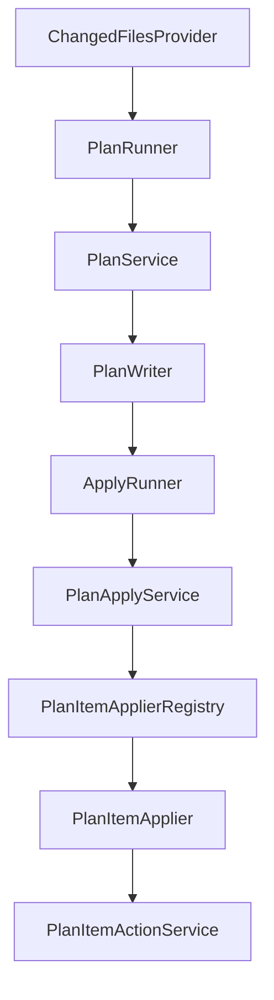

# Design Patterns in the Plan/Apply Framework

This repository relies on a small set of architectural patterns to keep the plan generator and apply runner maintainable and extensible. The patterns document below sits in `spec/` alongside the flow docs so future contributors can see how new categories and behaviors should plug into the structure.

## Strategy + Factory (Parsing)

- **Pattern**: Strategy + Factory  
- **Purpose**: Each file category has a dedicated `FileParsingStrategy` (e.g., `SideFileParsingStrategy`, `GeneralLedgerProfileFileParsingStrategy`). The strategies know how to identify their folder, deserialize JSON, and produce `LoadedFile` metadata.  
- **Implementation**: `FileParsingStrategyFactory` discovers all strategies (Spring-managed beans) and picks one via `supports(path)` while `PlanService` delegates to the first matching strategy.
- **Diagrams**:

## Template Method + Registry (Apply)

- **Pattern**: Template Method + Registry  
- **Purpose**: The apply path relies on a registry of `PlanItemApplier` instances, each of which handles a `FileCategory`. `AbstractPlanItemApplier` defines the template (resolve payload, invoke create/update/delete) while the concrete classes supply details.  
- **Implementation**: `PlanItemApplierRegistry` builds the map, `PlanApplyService` iterates the master plan and dispatches to the matching applier.  
- **Diagrams**:

## Adapter + State Repository (Cosmos Persistence)

- **Pattern**: Adapter  
- **Purpose**: `CosmosStateRepository` adapts Cosmos SDK calls to the `StateRepository` interface, abstracting storage details from `StateFileService`.  
- **Implementation**: Upsert/delete/find/list translate directly to Cosmos container operations, handling 404s and query parameter binding.  

## Builder-ish Helpers (Plan Items)

- **Pattern**: Fluent / Builder helpers in `PlanService` help construct `PlanItem`s from parsed payloads (e.g., splitting list resources or falling back to derived keys).  
- **Implementation**: `processPlanEntries` and `addDeletesForMissingChanges` reuse shared methods to generate actions from state documents without duplicating Cosmos lookups.

## Observer-style Logging (Runner Feedback)

- **Pattern**: Notified logging in `PlanRunner` and `ApplyRunner` mirrors an observer pattern: each runner runs, logs the progress, and prints warnings/errors without stopping the pipeline, making the tool resilient to extra arguments or missing files.

## Sequence Summary

Update this document when new patterns (e.g., event sourcing, CQRS) are introduced or when workflows change significantly.===
