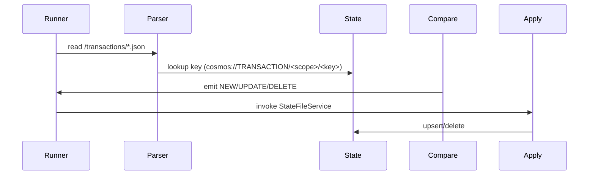
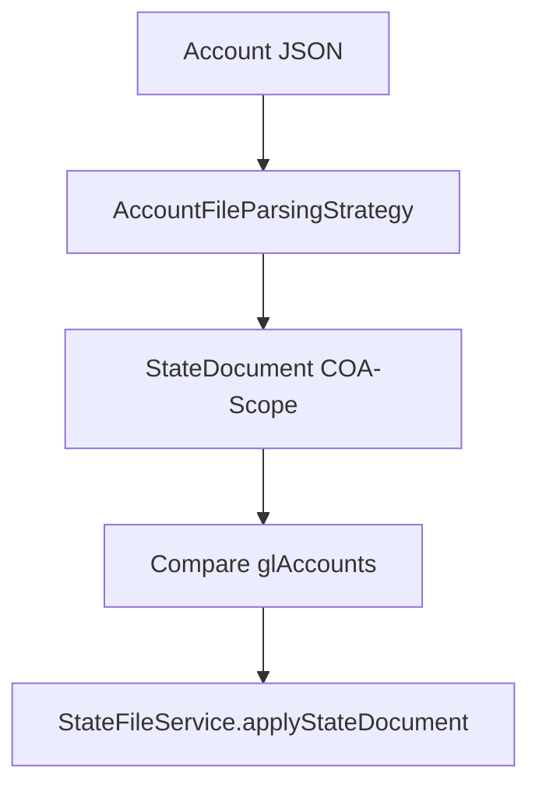
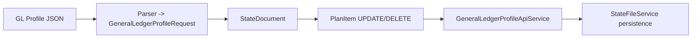
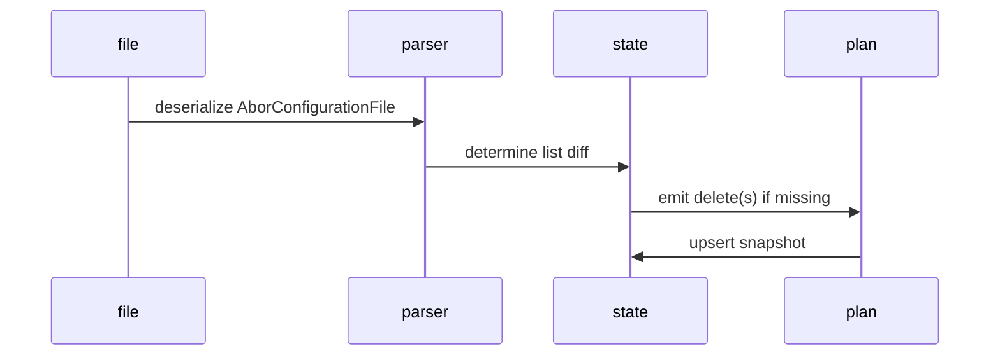
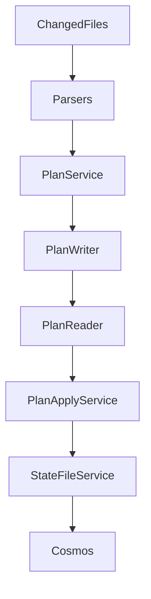

# Plan + Apply Reference by File Category

This reference sits alongside the detailed `spec/Sides/sides-plan-apply.md` document and extends the coverage to every supported file category. Each section covers:

1. **Plan responsibilities** – what parsing strategy, key derivation, and state comparisons happen.
2. **Apply responsibilities** – how `StateFileService` and the relevant appliers persist or delete entries.
3. **Diagrams** – Mermaid flows capturing the lifecycle.

---

## Side Files

- **Plan**: `SideFileParsingStrategy` identifies files under `changedfiles/<scope>/sides`, deriving keys from the filename (`sideCode-scope`). `PlanService` compares the parsed `SideFile` to the Cosmos `StateDocument (type=SIDE)` and emits NEW/UPDATE/DELETE as needed.
- **Apply**: `SidePlanItemApplier` routes items to `StateFileService.applySide`, which upserts or deletes the Cosmos document `sideCode-scope`.

```mermaid
flowchart TD
    S1[Changed side JSON]
    S2[SideFileParsingStrategy]
    S3[StateDocument lookup (cosmos://SIDE/<scope>/<key>)]
    S4[payload comparison]
    S5[PlanItem NEW/UPDATE/DELETE]
    A1[StateFileService.applySide]
    A2[Cosmos upsert/delete]

    S1 --> S2 --> S3
    S3 --> S4
    S4 --> S5
    S5 --> A1 --> A2
```

---

## Transactions

- **Plan**: `TransactionFileParsingStrategy` reads files under `changedfiles/<scope>/transactions`. Keys follow the filename `transactionCode`. The state comparison includes `transactionSequence` ordering when the rule requests it.
- **Apply**: `TransactionPlanItemApplier` persists the transaction payload to Cosmos via `StateFileService`, which writes the entire `TransactionFile` snapshot.



---

## Chart of Accounts

- **Plan**: Files under `changedfiles/<scope>/coa` parse into `ChartOfAccountsFile`. The key is the chart code (`COACODE`), and plan generation compares the request payload to the persisted document.
- **Apply**: Upserts create/update state documents containing `chartOfAccountsCode`, `scope`, and the request payload for future comparisons.

```mermaid
flowchart LR
    C1[ChartOfAccounts JSON]
    C2[Parser -> ChartOfAccountsRequest]
    C3[StateDocument (COA)]
    C4[Diff -> PlanItem]
    C5[StateFileService.persist COA]

    C1 --> C2 --> C3 --> C4 --> C5
```

---

## Account Files (GL Accounts)

- **Plan**: `AccountFileParsingStrategy` reads `changedfiles/<scope>/gla`. Keys include the chart code plus account code (`COACODE-Account`). Due to the normalization, comparison factors whitespace/case-insensitive code matching.
- **Apply**: Account list entries are rewritten as `AccountFile` snapshots containing `chartOfAccountsCode`, `scope`, and `glAccounts`.



---

## Posting Rules

- **Plan**: `PostingRulesFileParsingStrategy` monitors `changedfiles/<scope>/postingrules`. Keys follow `module-coa-scope`, and plan generation extracts the module and chart codes for state comparison.
- **Apply**: `PostingModulePlanItemApplier` triggers `StateFileService` to persist each module request, including the link to the chart code.

```mermaid
graph TB
    P1[PostingRules JSON]
    P2[Parser]
    P3[Cosmos state (type=POSTING_RULE)]
    P4[PlanItem]
    P5[StateFileService upsert]

    P1 --> P2 --> P3 --> P4 --> P5
```

---

## General Ledger Profile

- **Plan**: `GeneralLedgerProfileFileParsingStrategy` watches `changedfiles/<scope>/glprofile`. Keys include `profileCode-coa-scope`. The plan step normalizes to the chart code if missing.
- **Apply**: `GeneralLedgerProfilePlanItemApplier` delegates to `GeneralLedgerProfileApiService` (currently a logging stub) and uses `StateFileService` to keep state in sync.



---

## ABOR Configuration

- **Plan**: Files under `changedfiles/<scope>/aborconfigs` parse into `AborConfigurationRequest` lists; the key is the containing file name (e.g., `aborconfig-ATG`).
- **Apply**: The service writes aggregated lists per scope so deletes simply clear entries missing from changed files.



---

## ABOR Entries

- **Plan**: `AborFileParsingStrategy` splits `aborRequestList` and compares each code against state. Missing entries produce deletes; new ones produce NEW items.
- **Apply**: `StateFileService` reads existing `AborFile`, updates or removes entries, and writes the aggregate list back to Cosmos.

## Derived Portfolios & Portfolio Groups

- Both follow a two-step plan: parse list requests, compare with persisted snapshot, and emit plan items per entry (with deletes for absent codes).
- The apply phase rewrites the aggregate file containing the list of requests (supported by `StateFileService.persistListDocument`).

## Summary Diagram



Each parser/apply path for the categories above plugs into this template; the spec directory now contains the detailed Sides doc plus this cross-category reference for architects and developers.
